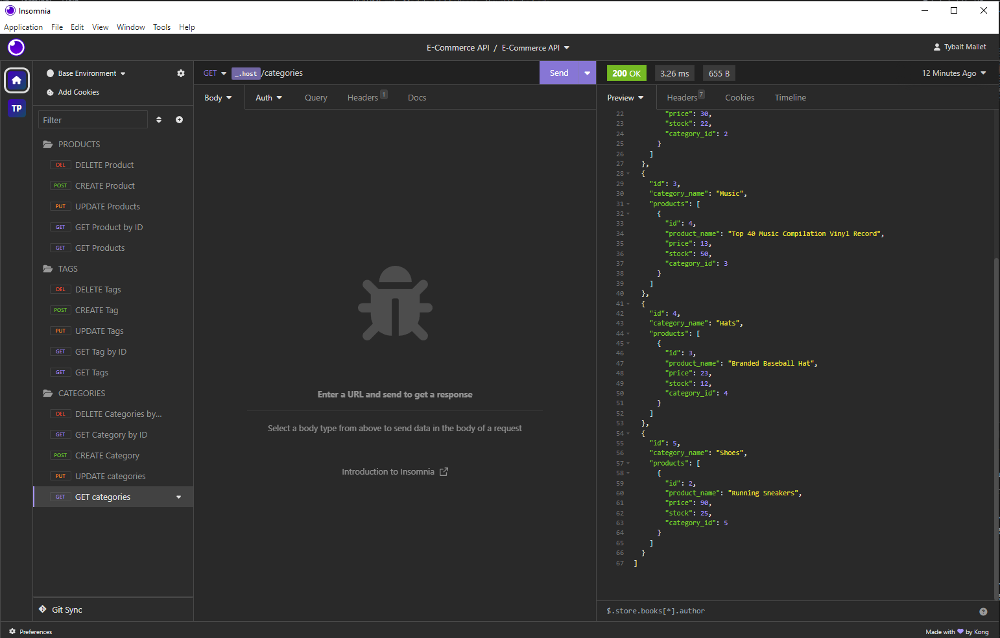

#  Object-Relational Mapping (ORM): E-Commerce Back End

## Video Demo Link

https://youtu.be/SSAu_TPhzys

## Description

This is the 13th Module project for the 13th week of the UCB Coding bootcamp, this week we focused on object relational mapping, and back end work using SQL and insomnia. We were given some starter code to complete, where we had to create schema tables, and finish their respective models and routes, so that everything was functional. As well as demonstrating the use of our code through inomnia.

## Table of Contents
- [Description](#description)
- [WebsiteSS](#Screenshot)
- [Installation](#installation)
- [Usage](#usage)
- [License](#license)
- [Tests](#tests)
- [Questions](#questions)

## Screenshot 

## Installation

Have sql, node and run npm install.

## Usage 

Initialize your schema tables using sql commands, and then execute your seeds using npm seed, then launch your port using npm start. Then you can edit the data in any way using a software like insomnia or something similar.  

## Tests

N/A
## Questions

For any questions, reach out to [notUnEeVeN](https://github.com/notUnEeVeN) or [email me](mailto:tybalt.mallet@gmail.com).
